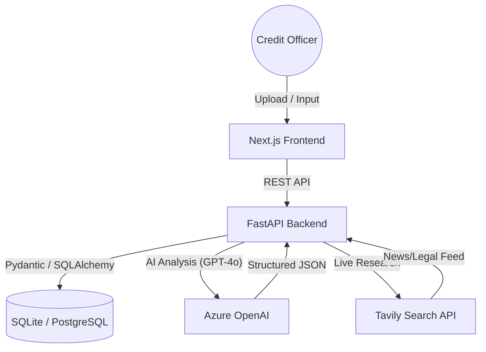

# 🛡️ IntelliCredit v3
> **Next-Gen AI Credit Analytics** for modern banking.

IntelliCredit v3 is an AI-first credit assessment platform designed for commercial banks and NBFCs. It automates high-precision document verification, external research, and the entire credit committee decision-making workflow.

---

## 🚀 Key Innovation Pillars

### 1. 🛡️ Document Consistency Audit
A high-precision cross-document verification engine that detects circular trading, revenue mismatch, and director inconsistencies across 5+ document types (P&L, GST, KYC, Sanction Letters).

### 2. 🎯 Scenario Simulator
An interactive "What-If" simulator that allows credit officers to test how changes in financial health (D/E, Current Ratio, etc.) instantly affect the credit grade and interest rate recommendations.

### 3. 🧠 Reasoning Engine (Evidence-Based Scoring)
Every score is backed by a 7-step reasoning chain extracting evidence directly from multi-modal document sources and real-time external research.

### 4. 🎙️ Voice-to-Text Observations
Capture field visit notes hands-free using the integrated Web Speech API, allowing real-world intelligence to influence the AI's final score in real-time.

---

## 🏗️ Architecture



---

## 🛠️ Technology Stack
- **Frontend**: Next.js 14, TailwindCSS, Lucide-React, Recharts.
- **Backend**: FastAPI (Python 3.11+), Pydantic v2, SQLAlchemy.
- **AI/LLM**: Azure OpenAI (GPT-4o), Tavily Web Search.
- **Database**: SQLite (Development) / PostgreSQL (Production ready).

---

## 🚦 Getting Started

### Backend Setup
```bash
cd backend
python -m venv venv
source venv/Scripts/activate  # Windows
pip install -r requirements.txt
uvicorn main:app --reload
```

### Frontend Setup
```bash
cd frontend
npm install
npm run dev
```

---

## 📁 Repository Structure
- `backend/`: FastAPI server, AI analysis services, and research scrapers.
- `frontend/`: Next.js application with interactive report & onboarding flows.
- `brain/`: Persistent project documentation and implementation walkthroughs.
